# 180° Analog Indicator (0-100) *ENG*

## Materials and Tools Required for Production:

### Programs:
- LightBurn Software
- PrusaSlicer (or any program compatible with your 3D printer)

### Tools:
- Engraving machine or laser engraver
- 3D printer

### Materials:
- Wooden plywood for the face (Dimensions: 220mm x 160mm x 4mm, Price: 19 CZK)
- Wooden plywood for the stands (Dimensions: 95mm x 40mm, Price: 12 CZK)
- 3D printer filament (Estimated consumption: 0.62m, Print duration: 15 minutes, Filament weight: approximately 1.76g, Price: 0.58 CZK)

### Electronics:
- MG90S Servo Motor (Price: 126 CZK)

### Files:
- 180_analog_indicator_face.svg (Indicator face)
- 180_analog_indicator_stand.svg (Stand for the indicator face plywood)
- 180_analog_indicator_pointer.STL (Pointer)

### Price:
- The total cost of all materials is approximately 158 CZK
- Plywood for the face: 19 CZK
- Plywood for the stands: 12 CZK
- Filament: 0.58 CZK
- Servo motor: 126 CZK

## Tutorial
1. Open the *180_analog_indicator_face.svg* file in LightBurn Software.
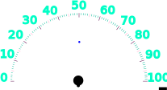
   - The black parts should be set to be cut through, while the other parts can be burned according to your preference. The blue dot represents the center of the indicator face and helps with aligning the plywood on the engraving machine's work surface. Adjust the dot to ensure it will not be burned.
> :warning: When placing the plywood on the engraving machine's work surface, it is important to be very precise. If it is positioned incorrectly, the black parts on the sides may not reach the edge of the plywood, potentially ruining it.

2. While the indicator face is being engraved, you can 3D print the pointer. Open the *180_analog_indicator_pointer.STL* file in your preferred 3D printing software compatible with your printer. Setting the infill to around 15 % should be suitable. Finish the settings and start the print process.

3. Once the indicator face is engraved, you can proceed with burning the stands. Open the *180_analog_indicator_stand.svg* file in LightBurn Software.

   - Set the green parts to be cut through, and you can begin.

4. At this point, you should have all the components ready.
   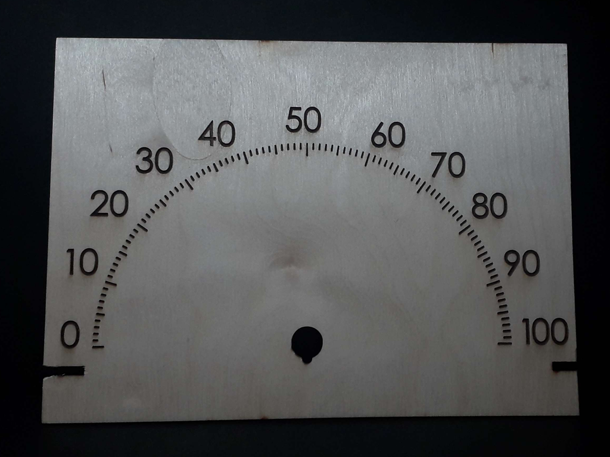
   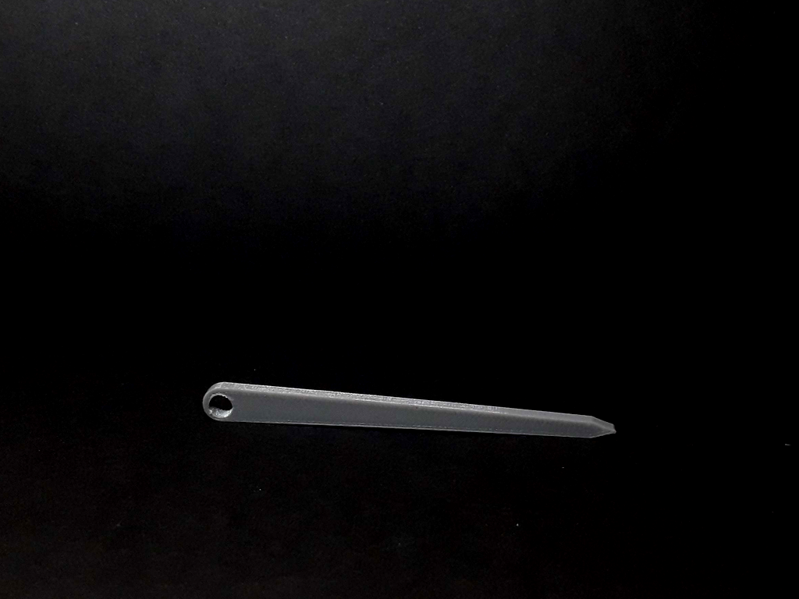
   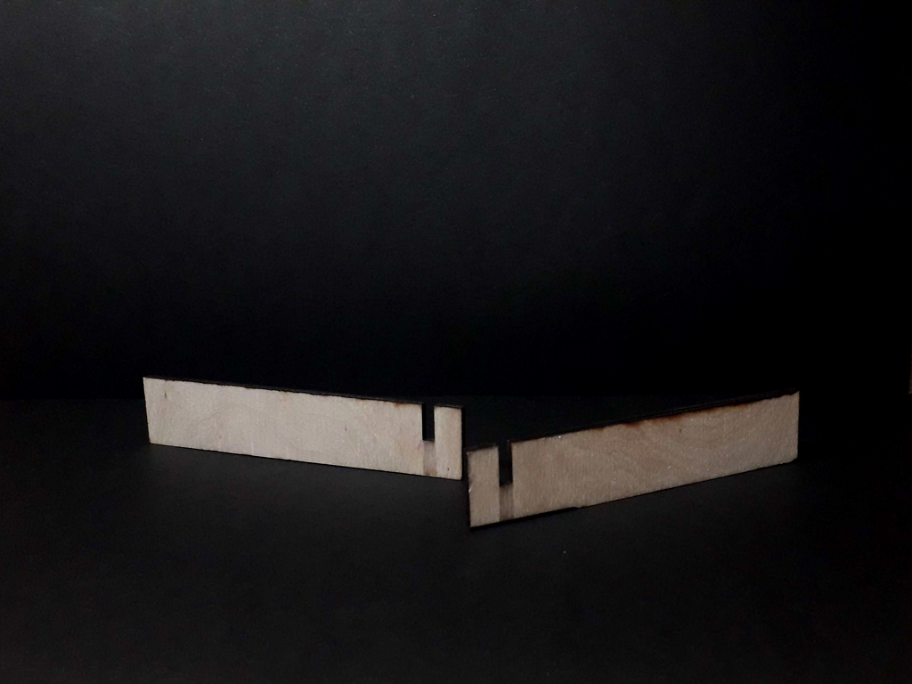

Now, let's assemble the parts!

## Assembly Steps
1. Take the plywood and flip it over. Insert the servo motor into the designated hole.
   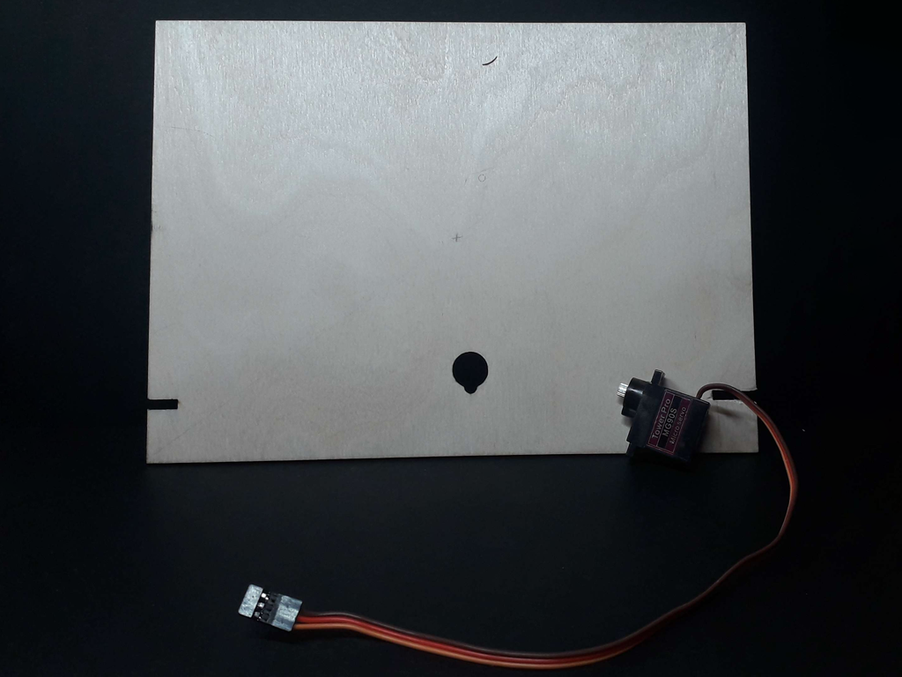
   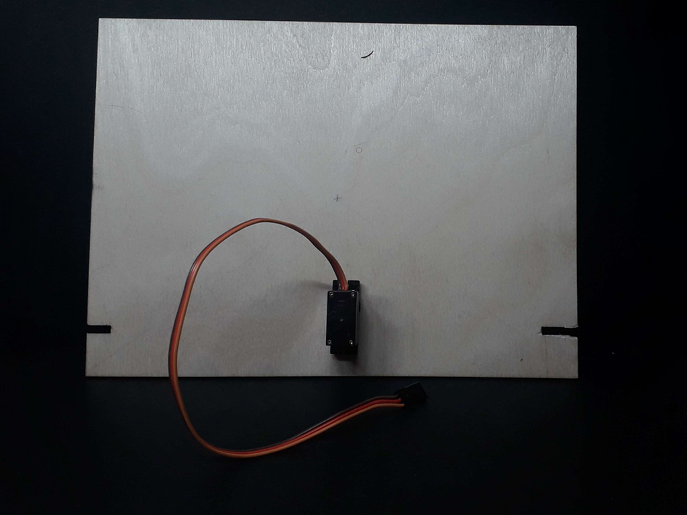

2. From the front side of the plywood, place the pointer onto the servo motor.
   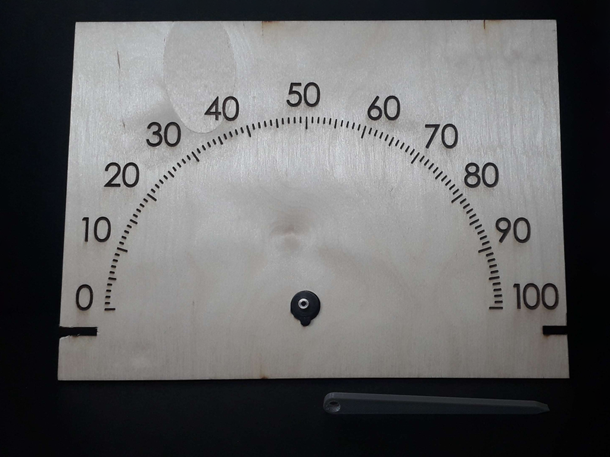
   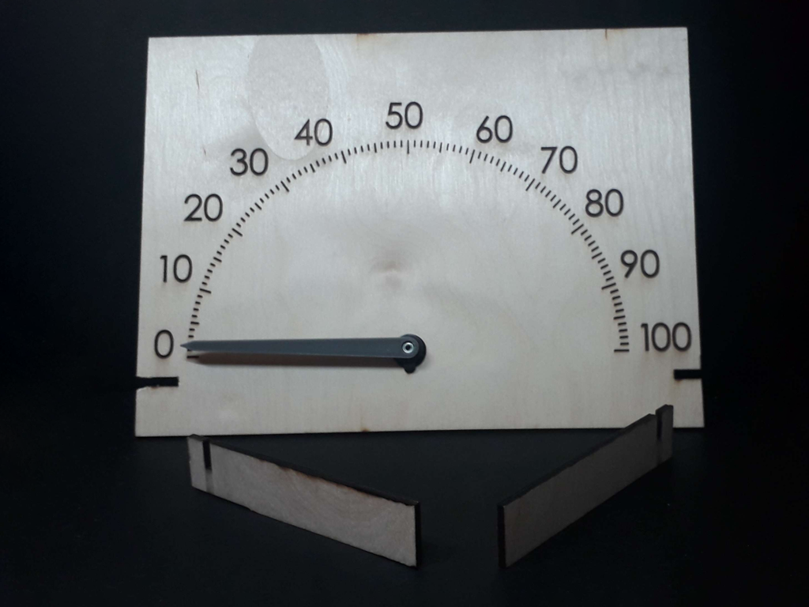

3. As shown in the previous image, prepare the stands and insert them into the corresponding holes. (Ensure that the holes in the stands align with the holes in the plywood.)
   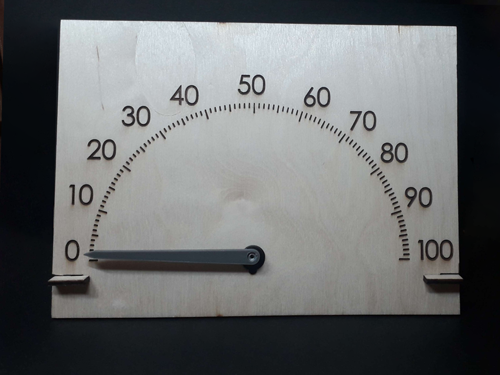

4. Congratulations! You have successfully completed the assembly of the **180° Analog Indicator (0-100)**.
   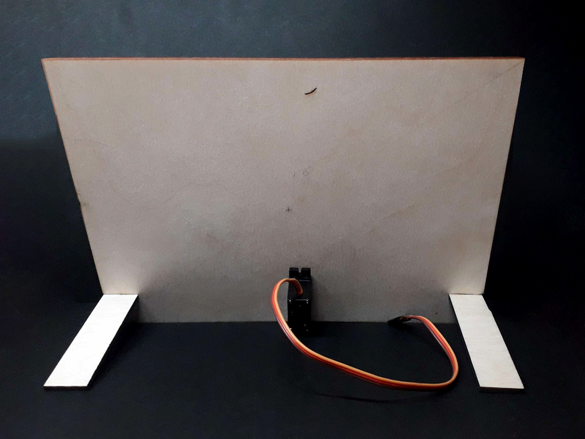
   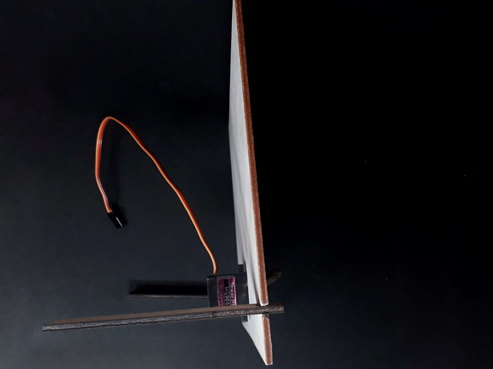

# 180° Analogový ukazatel (0-100) *CZE*

## Materiály a nástroje potřebné pro výrobu:

### Programy:
- LightBurn Software
- PrusaSlicer (nebo jakýkoliv jiný program kompatibilní s vaší 3D tiskárnou) 

### Nástroje:
- Laserová gravírka
- 3D tiskárna

### Materiály:
- Dřevěná překližka pro ciferník (rozměry: 220 mm x 160 mm x 4 mm, cena: 19 Kč)
- Dřevěná překližka pro stojánky (rozměry stojánků: 95 mm x 40 mm, cena: 12 Kč)
- Filament pro 3D tiskárnu (odhadovaná spotřeba: 0,62 m, trvání tisku: 15 minut, váha využitého filamentu: cca 1,76 g, cena: 0,58 Kč)

### Elektronika:
- Servo motor MG90S (cena: 126 Kč)

### Soubory:
- 180_analog_indicator_face.svg (ciferník)
- 180_analog_indicator_stand.svg (stojánky)
- 180_analog_indicator_pointer.STL (ukazatel)

### Celková cena:
- Celková cena všech součástek by měla být přibližně 158 Kč
- Překližka pro ciferník: 19 Kč
- Překližka pro stojánky: 12 Kč
- Filament: 0,58 Kč
- Servo motor: 126 Kč

## Návod
1. Otevřete soubor *180_analog_indicator_face.svg* v programu LightBurn Software. 

   - Černé části je třeba nastavit tak, aby je gravírka prořízla naplno. Ostatní části můžete vypálit dle vlastního uvážení. Modrá tečka představuje střed ciferníku a slouží pro snazší umístění překližky na pracovní plochu gravírovacího stroje. Nastavte tečku tak, aby se nevypálila.
> :warning: Při umisťování překližky na pracovní plochu gravírovacího stroje je důležité být velmi přesný, protože pokud ji umístíte špatně, černé části po stranách nemusí dosáhnout až na konec překližky.

2. Během gravírování ciferníku můžete začít tisknout ukazatel. Otevřete soubor *180_analog_indicator_pointer.STL* ve vašem preferovaném programu kompatibilním s vaší 3D tiskárnou. Doporučuji nastavit výplň ideálně na 15 %. Dokončete nastavení a spusťte tisk.

3. Po dokončení ciferníku můžete přistoupit k vypalování stojánků. V programu LightBurn Software otevřete soubor *180_analog_indicator_stand.svg*. 

   - Nastavte zelené části tak, aby se vyřízly, a můžete začít.

4. Nyní byste měli mít hotové všechny díly.

Nyní můžete přistoupit ke skládání.

## Postup skládání
1. Vezměte překližku s ciferníkem, otočte ji a vložte servo motor do vyřezaného otvoru.

2. Otočte překližku přední stranou a nasaďte ukazatel na servo motor.

3. Jak lze vidět na předchozím obrázku, připravte si stojánky. Vložte je do otvorů po stranách.

4. Hotovo! Gratuluji, dokončili jste **180° Analogový ukazatel (0-100)**.

