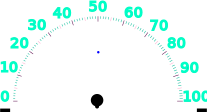

# 180° Analog indicator (from 0 to 100) *ENG*
## Materials and Tools Required for Production:

### Programs:
  - LightBurn Software
  - PrusaSlicer (or any program, that is compatible with your 3D printer) 

### Tools:
  - Engraving machine or laser engraver
  - 3D printer

### Materials:
  - Wooden plywood for the face (lenght: 220mm, width: 160mm, height: 4 mm, *19 CZK*) 
  - Wooden plywood for the stands (the stands are 95 mm x 40 mm, *12 CZK*)
  - 3D printer filament (it should use circa 0,62 m of filament and it should take about 15 minutes, it's about 1,76 g = *0,58 CZK*)

### Electronics:
  - Servo motor MG90S (126 CZK)

### Files:
  - 180_analog_indicator_face.svg (face of the indicator)
  - 180_analog_indicator_stand.svg (stand for the plywood with face)
  - 180_analog_indicator_pointera.STL (pointer)

### Price:
  - All the materials and etc. should be around *158 CZK*
  - Plywood for the face: 19 CZK, Plywood for the stands: 12 CZK, Filament: 0,58 CZK, Servo: 126 CZK

## Tutorial
1. Open the *180_analog_indicator_face.svg* in LightBurn Software. 

  - The black parts need to be set to be cut through. The other parts are suppossed to be burn out at your discretion. The blue dot is fot better adjusting of the plywood on the working space of the engraving machine. Set the dot so the laser ignors it.
> :warning: While adjusting the plywood on your engraving machine work place, you have to be very precise, because if you place it wrong, the black parts on the sides might not reach the end of the plywood, and you'll ruin your plywood.

2. While your indicator face is engraving, you can print the pointer. Open *180_analog_indicator_pointera.STL* in your prefered program that is compatible with your 3D printer. Fill around 15 % should be ideal. Set it and you can start printing.

3. When your face of the indicator is done, you can burn the stand. Open the *180_analog_indicator_stand.svg* in LightBurn Software. 

 - Set the green parts cut trough, and you can start.

4. Now you should have all parts done.
  
  
  

Now we can put it all together! Let's start.

## Putting it all together
  1. Take your plywood and turn it, and insert the servo inside the hole.
  
  

  2. Now take the plywood from the front and put on the pointer on the servo.
  
  

  3. As you can see on the picture before, now take your stands. Insert them into the holes. (The holes in the stands should face the holes in the plywood.)
  

  4. And now you're done! Congratulations, you've finished the **180° Analog indicator (from 0 to 100)**.
  
  

# 180° Analogový ukazatel (od 0 do 100) *CZE*
## Materiály a nástroje potřebné pro výrobu:

### Programy:
  - LightBurn Software
  - PrusaSlicer (nebo jakýkoliv program, co je kompatibilní s vaší 3D tiskárnou) 

### Tools:
  - Laserová gravírka
  - 3D tiskárna

### Materiály:
  - Dřevěná překližka pro ciferník (délka: 220mm, šířka: 160mm, výška: 4 mm, *19 Kč*) 
  - Dřevěná překližka pro stojánky (stojánky mají velikost 95 mm x 40 mm, *12 Kč*)
  - Filament do 3D tiskárny (mělo by to spotřebovat okolo 0,62 m filamentu a mělo by to trvat okolo 15 minut, váha využitého filamentu je cca 1,76 g = *0,58 Kč*)

### Elektronika:
  - Servo motor MG90S (126 Kč)

### Soubory:
  - 180_analog_indicator_face.svg (ciferník)
  - 180_analog_indicator_stand.svg (stojánky)
  - 180_analog_indicator_pointera.STL (ukazatel)

### Price:
  - Vše by to dohromady mělo vyjít okolo *158 Kč*
  - Překližka na ciferník: 19 CZK, Překližka na stojánek: 12 Kč, Filament: 0,58 Kč, Servo: 126 Kč

## Tutoriál
1. Otevřete *180_analog_indicator_face.svg* v LightBurn Software. 

  - Černé části je třeba nastavit tak, aby je gravírka prořízla naskrz. Ostatní části vypalte dle vašeho uvážení. Modrá tečka je přímo uprostřed a slouží pro jednodušší nastavení překližky na pracovním prostoru gravírovacího stroje. Nastavte tečku tak, aby se nevypálila.
> :warning: Při nastavování překližky na pracovišti gravírovacího stroje musíte být velmi přesní, protože pokud ji umístíte špatně, černé části po stranách nemusí dosáhnout konce překližky.

2. Během gravírování ciferníku můžete vytisknout ukazatel. Otevřete soubor *180_analog_indicator_pointera.STL* v preferovaném programu, který je kompatibilní s vaší 3D tiskárnou. Výplň okolo 15 % by měla být ideální. Nastavte jej a můžete začít tisknout.

3. Když je ciferník hotový, můžete začít vypalovat stojan. V LightBurn Software otevřete soubor *180_analog_indicator_stand.svg*. 

 - Nastavte zelené části tak, aby se vyřízly a můžete začít.

4. Nyní byste měli mít všechny díly hotové.
  
  
  

Teď to celé můžeme dát dohromady! Pojďme na to.

## Skládání dohromady
  1. Vezměte si vaší překližku s ciferníkem, otočte ji a vložte servo do vyřezaného otvoru.
  
  

  2. Nyní vezměte překližku zepředu a nasaďte ukazatel na servo.
  
  

  3. Jak můžete vidět na obrázku předtím, připravte si stojánky. Vložte je do otvorů po stranách.
  

  4. A máte hotovo! Gratuluji, dokončili jste **180° Analogový ukazatel (od 0 do 100)**.
  
  
